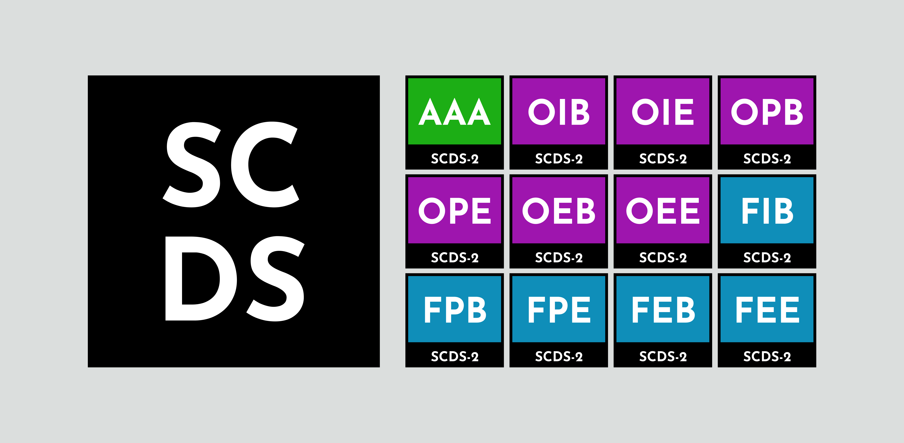
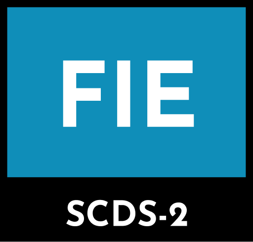

# SCDS Rating System
The synthetic content disclosure score (SCDS) rating system informs clients and investors about AI usage in your products.

## Get Rated
Learn about the rating system and complete the questionaire to get a rating on your product on the website:

**https://scds.igottic.com/**

## How It Works
A rating now consists of three letters:

* **Frequency:** A (absent), O (occasional), or F (frequent)
* **Role:** A (absent), I (implementation), P (planning), or E (both implementation and planning)
* **Scope:** A (absent), B (backend), or E (experience)

AAA means no AI was used anywhere in development. The rating does not speak to product quality.

## How It's Calculated
The questionnaire directly defines the rating. It no longer calculates a score behind the scenes in V2. The question and answer data is stored in `questions.json`.

## Resources
You can get the up-to-date image content inside of `static/img`, such as rating icons.

## Self-Rating
Of course, this tool needs to be self-rated! AI has been used to build the website, based on the system, design, and more from me. I'm not savvy with web development, so I had to leave the CSS work to AI.

